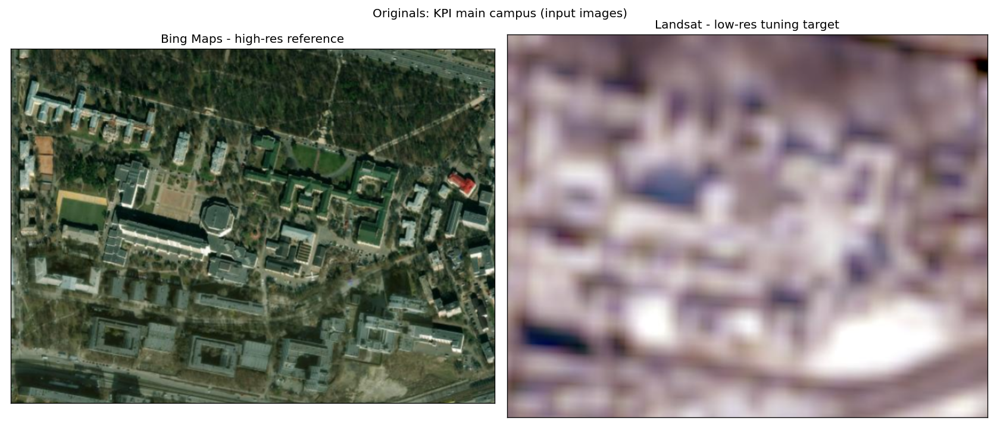
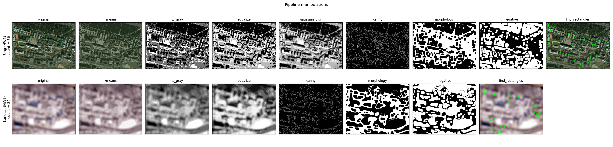
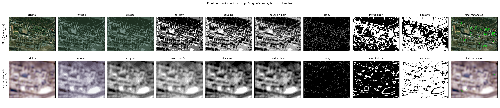
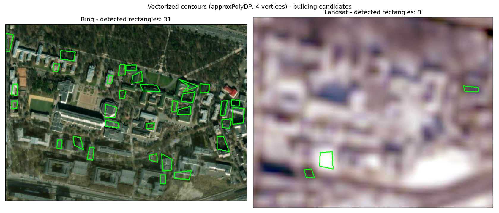
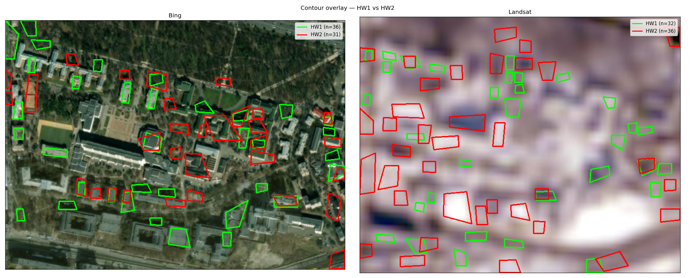

# Raste-Vector-Image-Processing

HW1 + HW2 — Level 3. Count buildings on the KPI main campus from two image sources (Bing Maps, Landsat), and tune a raster-processing + vectorization pipeline so the low-res Landsat count approaches the high-res Bing reference.

- **HW1** establishes the baseline pipeline (color correction → Canny → contours → polygon approximation).
- **HW2** extends it with Module 2 stages (filtering + brightness/contrast correction), plus a custom LAB warm/cool color separation for vegetation removal and a convexity filter on the polygon stage.

## Sources

- Landsat: https://livingatlas2.arcgis.com/landsatexplorer/
- Bing Maps: https://www.bing.com/maps

## Setup

```bat
py -m venv .venv
.\.venv\Scripts\activate.bat
pip install -r requirements.txt
python main.py
```

`main()` runs the HW1 baseline pipelines first, then the HW2 candidate pipelines (with `seed=42` for reproducibility), and finishes with a side-by-side overlay comparing both. Set `SAVE_DIR_HW1` / `SAVE_DIR_HW2` near the top of `main.py` to write artifacts to disk (defaults: `outputs/hw1`, `outputs/hw2`), or set either to `None` to skip saving.

## Layout

| File | Purpose |
|---|---|
| `main.py` | Entry point — paths, per-task params, save dirs, runs both pipelines |
| `pipeline.py` | `run_pipeline`, `save_stage_snapshots`, the `STAGES` registry |
| `stages_m1.py` | Module 1 (HW1) stage functions + `M1_STAGES` dict |
| `stages_m2.py` | Module 2 (HW2) stage functions + `M2_STAGES` dict |
| `viz.py` | Plotting helpers (originals, pipeline grid, contours, overlay) |
| `task2.ipynb` | HW2 iteration log — per-stage exploration + candidate tuning |
| `METHODS.md` | Catalog of every CV method in M1 / M2, with source-file references |
| `media/` | Input images (`bing.png`, `landsat.png`, alternates) |
| `outputs/hw1/`, `outputs/hw2/` | Per-task saved figures and per-stage snapshots |

---

## HW1 — Results

### Inputs



### General observations

- **Canny `low` / `high`** — tested with same values to see what gets rejected vs accepted.
- **Double outlines.** With Canny alone the contours came out as "double outlines": two parallel lines on each side of every real edge (one for the building edge, one for its shadow). `findContours` then traced both as separate contours, so what looked like a building was really a thin frame around it. `morphology(close)` merges those parallel lines into one thick band, which fixes it.
- **Polarity flip.** `morphology(close)` on Canny output produces a white texture-soup with building-shaped *holes*. `findContours` (RETR_EXTERNAL) only sees outer boundaries, so the buildings get ignored. Adding `negative` right after flips the holes into white blobs that `findContours` can detect.
- **kmeans before `to_gray`** separates colors that would otherwise collapse to the same grayscale value:
  - On **Bing** it reduced trees / sport fields being mis-identified as roofs (green vs gray were getting flattened to the same brightness).
  - On **Landsat** it sharpened the boundaries of blurry blobs — snapping each pixel to one of K dominant colors turns fuzzy gradients into flat regions with crisp edges, so objects look more defined and texture noise inside them disappears.
- **Strict 4-vertex filter** from the lesson works once `approx_eps` is loosened to ~0.08 — heavy polygon simplification collapses curvy roofs down to 4 corners.

### Pipeline grid (per-stage snapshots)



### Bing (high-res reference)

| Stage | Params |
|---|---|
| `kmeans` | `K=3` |
| `to_gray` | — |
| `equalize` | — |
| `gaussian_blur` | `ksize=15` |
| `canny` | `low=50, high=160` |
| `morphology` | `op=close, shape=rect, ksize=8, iters=2` |
| `negative` | — |
| `find_rectangles` | `eps=0.08, area 400–3000, vertices=4` |

**Conclusion:** not all buildings detected and some false positives remain, but a clear subset of real buildings is recognised.

### Landsat (low-res tuning target)

| Stage | Params |
|---|---|
| `kmeans` | `K=9` |
| `to_gray` | — |
| `equalize` | — |
| `canny` | `low=150, high=200` |
| `morphology` | `op=close, shape=rect, ksize=8, iters=2` |
| `negative` | — |
| `find_rectangles` | `eps=0.08, area 400–3000, vertices=4` |

**Conclusion:** count is approximate — Landsat resolution loses small buildings entirely.

### Detected rectangles


---

## HW2 — Results

Extends HW1 with Module 2 filtering and brightness/contrast stages, plus two custom additions: a LAB warm/cool color-separation stage (`warm_cool_mask`) and a convexity filter on `find_rectangles` (`only_convex`).

The iteration log — per-stage exploration on raw images, candidate pipeline tuning, A/B comparisons — lives in [`task2.ipynb`](task2.ipynb). What follows is the summary.

### Starting point

The HW1 baseline failure modes are different per image:

- *Bing*: roofs share colour with grass / trees / sports fields, so background green textures keep producing building-shaped contours.
- *Landsat*: a different image from a different time — gray-purple, no greens at all. Roofs are clearly lighter than ground, but the heavy blur fuses adjacent buildings into single amorphous lobes and Canny traces them as fuzzy nested rings.

### Pipeline grid (per-stage snapshots)



### Bing — warm vs cool greens

While inspecting the Bing image and the per-stage outputs I noticed that grass / trees / sports fields are *warm* greens (yellowish), while the painted green roofs are *cool* greens (bluish). In RGB and grayscale they collapse to the same value — that's why HW1 kept confusing them. Did some research and decided to try splitting them in the LAB colour space, where the `b` channel is the blue↔yellow axis: both groups sit on the green side of `a`, but they cleanly split on `b` (warm > 128 > cool).

Added a new stage `warm_cool_mask` (in `stages_m2.py`) that converts to LAB, thresholds on `b`, and blacks out the warm half — wiping out vegetation before the rest of the pipeline runs.

**Iterations:**
- Added `warm_cool_mask` (`threshold=140`). With the mask in place, `kmeans` no longer helps and actually hurts the count — removed it.
- Added `only_convex=True` to `find_rectangles` to drop concave quadrilaterals (pinched / arrow shapes that slip through `min_vertices=4`).
- Tried `bbhe` / `dsihe` as alternatives to `equalize` — both gave worse results, kept the original.

**Final Bing pipeline:**

| Stage | Params |
|---|---|
| `warm_cool_mask` | `threshold=140` |
| `bilateral` | `d=9, sigma_color=75, sigma_space=75` |
| `to_gray` | — |
| `equalize` | — |
| `gaussian_blur` | `ksize=15` |
| `canny` | `low=50, high=180` |
| `morphology` | `op=close, shape=rect, ksize=8, iters=2` |
| `negative` | — |
| `find_rectangles` | `eps=0.08, area 400–3000, vertices 4–6, only_convex=True` |

### Landsat — quality enhancement

LAB-`b` doesn't apply here (no green to mask). The problem is blur + narrow brightness range, so the strategy shifted to *quality enhancement before* the existing HW1 pipeline:

**Iterations:**
- `pow_transform(gamma=1.5)` pushes midtones (ground) toward black while keeping highlights (roofs) bright.
- `hist_stretch(low_pct=5, high_pct=95)` spreads the resulting range to use the full 0–255 axis.
- `pil_filter('EDGE_ENHANCE')` chosen over manual `sharpen` after side-by-side trials — gentler, less noise amplification on the already-noisy image.
- `kmeans(K=4)` kept (quantizes fuzzy lobes into a few discrete levels Canny can latch onto).
- `morphology(close)` made more aggressive (`ksize=9, iters=3`) to bridge the broken Canny rings into solid blobs.
- `find_rectangles` loosened: `max_vertices=20` (KPI buildings here are not strictly 4-sided), `only_convex=False` (blurry shapes often come out slightly concave), and `min_area` bumped from 400 → 700 to drop the tiny noise rectangles that show up in low-contrast regions.

**Final Landsat pipeline:**

| Stage | Params |
|---|---|
| `pow_transform` | `gamma=1.5` |
| `hist_stretch` | `low_pct=5, high_pct=95` |
| `pil_filter` | `mode=EDGE_ENHANCE` |
| `kmeans` | `K=4` |
| `to_gray` | — |
| `equalize` | — |
| `canny` | `low=80, high=150` |
| `morphology` | `op=close, shape=rect, ksize=9, iters=3` |
| `negative` | — |
| `find_rectangles` | `eps=0.08, area 700–5000, vertices 4–20, only_convex=False` |

### Detected rectangles



### HW1 vs HW2 — overlay

Contours from both pipelines drawn on the same image — HW1 in green, HW2 in red.



### Overall

- **Bing.** The new stages cut down false positives in several spots (grass and tree patches that HW1 counted as buildings) and caught a few extra correct roofs HW1 missed. The trade-off: some buildings the HW1 baseline did detect are now lost, and `warm_cool_mask` is binary, so any roof whose colour doesn't fall on the cool side of the threshold gets dropped along with the vegetation.
- **Landsat.** Visibly cleaner than the baseline — fewer scattered noise quads, detections cluster closer to actual roof centres. But the resolution itself is the hard limit: where two buildings are blurred into one, no preprocessing can recover the separation.
- **Both images.** A real ceiling on this task is the dataset: many KPI buildings are non-rectangular — connected wings, courtyards, L- and U-shaped corpuses — so any rectangle-based detector has a fundamental limit here.

**Cross-cutting**
- Apply the warm/cool LAB intuition to other satellite images where vegetation is the main confounder.
- Replace `find_rectangles` with a non-rectangular shape detector (or a learned model) for the L- and U-shaped KPI corpuses.

---

