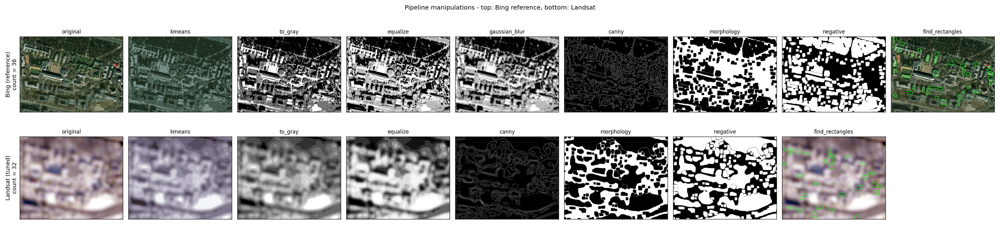
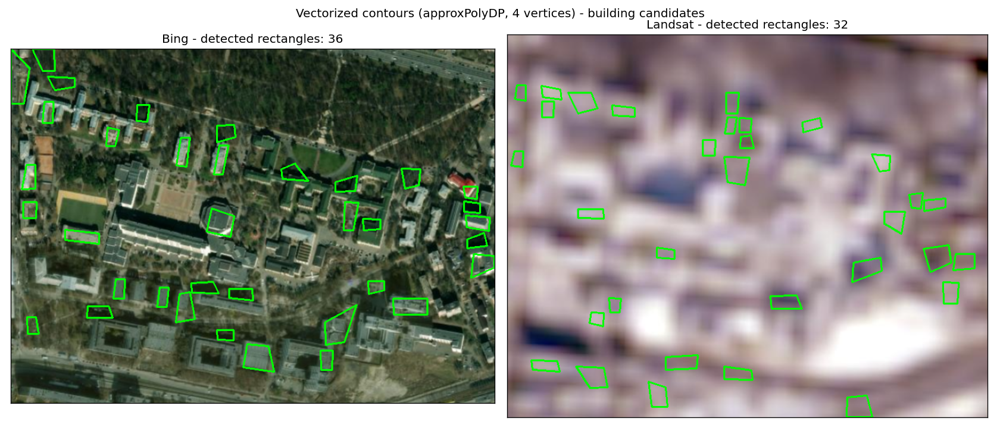

# Raste-Vector-Image-Processing

HW1 - Level 3. Count buildings on the KPI main campus using two image sources
and find a raster-processing + vectorization combo that aligns the low-res
Landsat count with the high-res Bing Maps reference.

## Sources

- Landsat: https://livingatlas2.arcgis.com/landsatexplorer/
- Bing Maps: https://www.bing.com/maps

## Setup

```bat
py -m venv .venv
.\.venv\Scripts\activate.bat
pip install -r requirements.txt
python main.py
```

## Layout

- `main.py` - pipeline: load -> color correction -> vectorize -> count
- `media/` - input images
- `outputs/` - generated edge maps, contour overlays, comparison plots


## Notes — results & conclusions

### Inputs


### General observations

- **Canny `low` / `high`** — tested with same values to see what gets rejected vs accepted.
- **Double outlines.** With Canny alone the contours came out as "double outlines": two parallel lines on each side of every real edge (one for the building edge, one for its shadow). `findContours` then traced both as separate contours, so what looked like a building was really a thin frame around it. `morphology(close)` merges those parallel lines into one thick band, which fixes it.
- **Polarity flip.** `morphology(close)` on Canny output produces a white texture-soup with building-shaped *holes*. `findContours` (RETR_EXTERNAL) only sees outer boundaries, so the buildings get ignored. Adding `negative` right after flips the holes into white blobs that `findContours` can detect.
- **kmeans before `to_gray`** separates colors that would otherwise collapse to the same grayscale value:
  - On **Bing** it reduced trees / sport fields being mis-identified as roofs (green vs gray were getting flattened to the same brightness).
  - On **Landsat** it sharpened the boundaries of blurry blobs — snapping each pixel to one of K dominant colors turns fuzzy gradients into flat regions with crisp edges, so objects look more defined and texture noise inside them disappears.
- **Strict 4-vertex filter** from the lesson works once `approx_eps` is loosened to ~0.08 — heavy polygon simplification collapses curvy roofs down to 4 corners.

### Pipeline grid (per-stage snapshots)



### Bing (high-res reference)

Final stages:

| Stage | Params |
|---|---|
| `kmeans` | `K=3` |
| `to_gray` | — |
| `equalize` | — |
| `gaussian_blur` | `ksize=15` |
| `canny` | `low=50, high=160` |
| `morphology` | `op=close, shape=rect, ksize=8, iters=2` |
| `negative` | — |
| `find_rectangles` | `eps=0.08, area 400–3000, vertices=4` |

**Conclusion:** not all buildings detected and some false positives remain, but a clear subset of real buildings is recognised.

### Landsat (low-res tuning target)

Final stages:

| Stage | Params |
|---|---|
| `kmeans` | `K=9` |
| `to_gray` | — |
| `equalize` | — |
| `canny` | `low=150, high=200` |
| `morphology` | `op=close, shape=rect, ksize=8, iters=2` |
| `negative` | — |
| `find_rectangles` | `eps=0.08, area 400–3000, vertices=4` |

**Conclusion:** count is approximate — Landsat resolution loses small buildings entirely.

### Detected rectangles



## Helpful resources

Resources that helped me along the way:

- Sobel — https://www.youtube.com/watch?v=uihBwtPIBxM&t=440s
- Canny — https://www.youtube.com/watch?v=sRFM5IEqR2w
